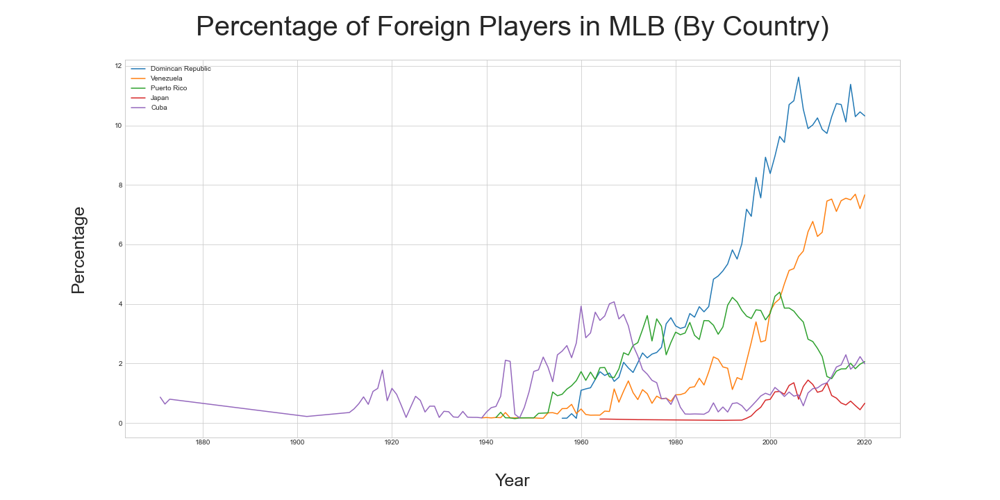
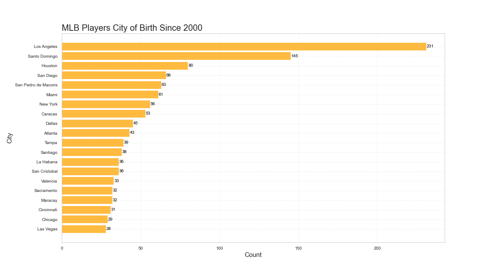
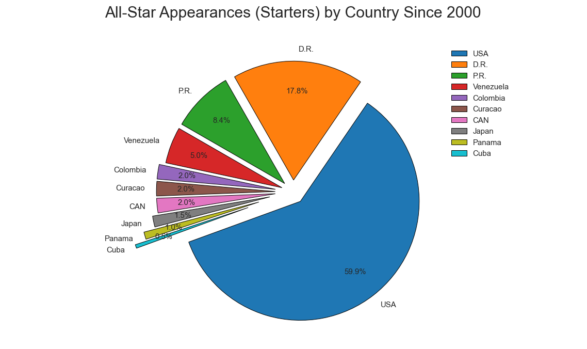

# Globalization in Major League Baseball

## Table of contents
* [Introduction](#Introduction)
* [Technologies](#Technologies)
* [Visualizations](#Visualizations)

### Introduction
The aim of this analysis is to visualize the increasing diversity of MLB players' nationalities. In addition, a deeper analysis is conducted to find exactly where players are coming from down to the State and City levels of each country. 

##### The analysis attempts to answer the following questions:

What does Globalization in MLB look like?

What Countries, Cities, and States produce the most MLB players?

Do players from certain Countries outperform others?

## Technologies

Project was created with:
* Python 3.6
* Pandas
* Numpy
* Matplotlib
* Jupyter Notebook

## Visualizations (Examples)

#### What does Globalization in MLB look like?

#### The largest overall producing cities of MLB talent are not limited to those in the US.

#### When normalizing to the overall breakdown of nationalities, we see where certain countries are over represented in the All-Star game.

!(./Visualizations/foreigncity_line.png)

